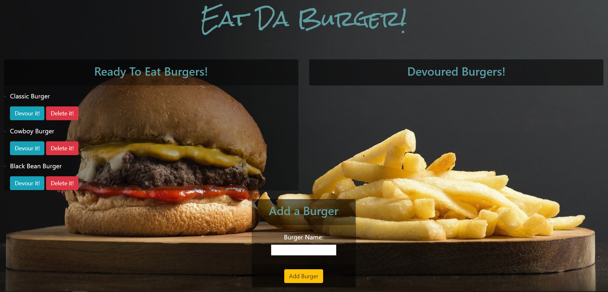

# Eat Da Burger App

**Creator**: `Scott Ladd`

**Created on**: `Nov 26th 2019`

- - -

## ABOUT THE APP
Eat Da Burger App is a burger logger with MySQL, NodeJS, Express, Handlebars and a homemade ORM (yum!). It follows the MVC design pattern, Node and MySQL to query and route data in your app, and Handlebars to generate your HTML.

The front end design was created using HTML, CSS, Javascript, and BootStrap. The backend components comprised of Javascript, Nodejs, 
and these 3 Node packages: [Express](https://www.npmjs.com/package/express) | [MySQL](https://www.npmjs.com/package/mysql) | 
[Express-Handlebars](https://www.npmjs.com/package/express-handlebars).

- - -

## Deployed Site

This App is deployed on *Heroku* [click Here](https://eatdaburger78373.herokuapp.com/) to view it.

- - -

## TECHNOLOGIES USED
* BootStrap
* FontAwesome
* HTML
* CSS
* Javascript
* Nodejs
* MySQL WorkBench
* JawsDB
* Node packages:
    * Express
    * Nodemon
    * Express-Handlebars
    * MySQL
* Git
* GitHub